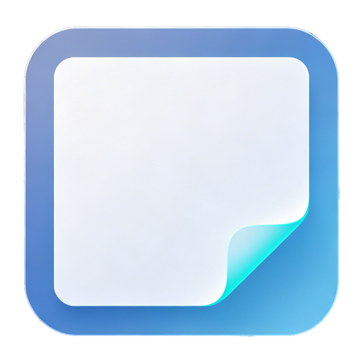

<div align="center">

[English](README.md) | [中文](README_CN.md)



# OncePad

**轻量级即唤即用的随身笔记本，从临时片段到 AI 提示词，所有零散文字都有一处安放之地。**

按下全局快捷键唤出，输入文字，再按一次——内容已复制到剪贴板，随时粘贴到任何地方。


</div>

---

## 它能做什么

- ⚡ **即时唤出** — 全局快捷键从任何应用中唤出编辑器，同样快速隐藏
- 📋 **隐藏即复制** — 窗口隐藏瞬间文本已复制到剪贴板，无需额外操作
- 🗂️ **工作区** — 将笔记组织到不同工作区，区分不同场景
- 🏷️ **标签** — 为笔记添加标签，便于筛选和查找
- 🎨 **颜色标记** — 6 种颜色直观分类笔记
- 📌 **置顶收藏** — 重要笔记始终触手可及
- 📝 **Markdown 支持** — 完整 Markdown 渲染，支持实时预览切换
- 📖 **代码/阅读模式** — 在编辑视图和阅读视图之间切换
- 🔢 **行号显示** — 可选，支持逻辑行号或视觉行号模式
- 📑 **大纲** — 通过文档标题快速跳转
- 🗺️ **缩略图** — 文档概览，快速滚动定位（试验性）
- 🔢 **序号补全** — VS Code 风格的列表序号智能补全（1. / a. / ① / 一、 / -）
- 📂 **文件菜单** — 直接打开/保存/另存为文件；支持拖拽文本文件（.md / .txt / .log / 代码文件）
- 📄 **广泛格式支持** — 可打开任意纯文本文件，即使后缀名不常见（基于内容检测）
- 👁️ **MD 默认浏览** — Markdown 文件默认以阅读模式打开，其他格式默认编辑模式
- 💾 **保存反馈** — Ctrl+S 保存成功后弹出 toast 视觉确认
- 🚪 **可靠关闭** — 强制关闭机制，修复关闭 Markdown 文件时程序卡死的问题
- ⚡ **快速打开** — 资源管理器双击文件时复用已有窗口，避免新进程启动开销
- 📋 **异常日志** — 程序崩溃/卡死日志存储在固定路径，设置→管理→高级中可快速跳转
- 🔗 **广泛文件关联** — 注册为 40+ 种文件类型的默认编辑器（.md / .txt / .js / .py / .json / .csv / .sh / .html / .css 等）
- ℹ️ **关于对话框** — 查看应用版本和系统信息，附 GitHub 仓库快捷链接
- 🌐 **11 种语言** — 简体中文 / 繁體中文 / English / 日本語 / 한국어 / Deutsch / Français / Español / Português (Brasil) / Русский / Italiano
- 🎛️ **导航栏自定义** — 显示/隐藏标题栏按钮（收藏/颜色/新建/复制/笔记）
- 🔤 **字体定制** — 中英文字体分离，可调字号、行高、内边距
- 🔍 **界面缩放** — 80%–150% 全界面缩放
- 🌙 **深色/浅色主题** — 一键切换主题模式
- 📌 **窗口置顶** — 将窗口保持在其他应用上方
- 🚀 **开机自启** — 系统启动时自动运行，可隐藏到托盘
- 👻 **失焦隐藏** — 窗口失去焦点时自动隐藏到托盘
- 🗑️ **回收站自动清理** — 已删除笔记进入回收站，可配置保留时长（1/2/3/7 天）
- 📜 **历史记录** — 新建草稿时自动保存历史记录
- ⌨️ **可配置快捷键** — 自定义唤出、新建、复制快捷键

<details>
<summary><strong>完整功能一览</strong></summary>

| 分类 | 功能 | 说明 |
|:-----|:-----|:-----|
| 核心 | 即时唤出 | 全局快捷键从任何应用唤出编辑器 |
| 核心 | 隐藏即复制 | 窗口隐藏时文本自动复制到剪贴板 |
| 核心 | 历史记录 | 新建草稿时自动保存历史（最多 100 条） |
| 核心 | 文件菜单 | 从标题栏菜单打开/保存/另存为/关闭文件 |
| 核心 | 关于对话框 | 应用版本 + 系统信息 + GitHub 链接 |
| 笔记 | 工作区 | 将笔记组织到独立工作区 |
| 笔记 | 标签 | 为笔记添加标签便于筛选 |
| 笔记 | 颜色标记 | 6 种颜色（默认/红/橙/黄/绿/蓝/紫） |
| 笔记 | 置顶收藏 | 重要笔记始终可访问 |
| 笔记 | 草稿 | 自动保存草稿，可配置清理周期 |
| 笔记 | 回收站 | 已删除笔记，自动清理（1/2/3/7 天） |
| 编辑器 | Markdown | 完整 Markdown 渲染 + 实时预览 |
| 编辑器 | 代码/阅读模式 | 编辑视图与阅读视图切换 |
| 编辑器 | MD 默认浏览 | MD 文件默认阅读模式，其他格式默认编辑模式 |
| 编辑器 | 行号 | 逻辑行号或视觉行号模式 |
| 编辑器 | 大纲 | 通过文档标题快速跳转 |
| 编辑器 | 缩略图 | 文档概览（试验性） |
| 编辑器 | 序号补全 | VS Code 风格列表序号智能补全 |
| 编辑器 | 字体定制 | 中英文字体分离，字号/行高/内边距可调 |
| 编辑器 | 界面缩放 | 80%–150% 全界面缩放 |
| 文件 | 对话框打开 | 系统文件对话框，多种格式筛选 |
| 文件 | 拖拽打开 | 拖拽 .md / .txt / .log / 代码文件到编辑器 |
| 文件 | 内容检测 | 后缀名未收录时检测内容，纯文本即可打开 |
| 文件 | 保存/另存为 | 保存到原路径或另存为新文件 |
| 国际化 | 11 种语言 | zh-CN/zh-TW/en/ja/ko/de/fr/es/pt-BR/ru/it |
| 界面 | 导航栏自定义 | 显示/隐藏 6 个标题栏按钮（设置按钮锁定） |
| 界面 | 深色/浅色主题 | 深色与浅色模式切换 |
| 窗口 | 窗口置顶 | 窗口保持在其他应用上方 |
| 窗口 | 开机自启 | 系统启动时运行，可隐藏到托盘 |
| 窗口 | 失焦隐藏 | 窗口失去焦点时自动隐藏 |
| 窗口 | 关闭行为 | 隐藏到托盘/确认退出/直接退出 |
| 快捷键 | 唤出窗口 | 全局快捷键（默认：Alt+Q） |
| 快捷键 | 新建笔记 | 全局快捷键（可自定义，默认：空） |
| 快捷键 | 复制 | 全局快捷键（可自定义，默认：空） |

</details>

## 安装

### 预构建二进制

从 [Releases](../../releases) 页面下载最新版本。

- **Windows（安装版，推荐）**：下载 `OncePad-Setup-x.x.x.exe`，运行安装程序，OncePad 将永久安装到 `AppData\Local\Programs\OncePad\`。安装版会注册 40+ 种文件类型关联，在资源管理器中双击 `.md` / `.txt` / `.js` / `.py` / `.json` 等文件时可直接用 OncePad 打开。安装版还会出现在右键菜单"打开方式"中。
- **Windows（便携版）**：下载 `OncePad x.x.x.exe`，直接运行，无需安装。注意：便携版是 7z 自解压可执行文件（约 200 MB），每次启动时会解压到临时目录，在资源管理器中双击文件打开时可能有数秒延迟。日常使用强烈建议选择安装版。
- **macOS**：下载 `.dmg`（注意：未签名，若被阻止运行 `xattr -cr "/Applications/OncePad.app"`）
- **Linux**：下载 `.AppImage`，赋予执行权限后运行

### 从源码构建

```bash
git clone https://github.com/MagicalYuYu/OncePad.git
cd OncePad
npm install
npm run dev
```

## 工作原理

1. 按下 `Alt+Q`（默认）从任何应用唤出编辑器
2. 输入文字——自动保存为草稿
3. 再按一次快捷键——窗口消失，文本已复制到剪贴板
4. 粘贴到任何需要的地方

就这么简单。没有保存对话框，没有文件管理，没有摩擦。

## 开发

```bash
# 安装依赖
npm install

# 启动开发服务器
npm run dev

# 生产构建
npm run build

# 打包当前平台
npm run dist

# 仅打包 Windows
npm run build:win
```

## 技术栈

- **Electron** — 跨平台桌面框架
- **React** — UI 库
- **TypeScript** — 类型安全的 JavaScript
- **Vite** — 构建工具和开发服务器
- **i18next** — 国际化框架（11 种语言）
- **markdown-it** — Markdown 解析器

## 致谢

OncePad 是受 One-Time Editor 启发的衍生项目，经深度重构与大幅扩展，新增 12 个独立功能模块，采用 GNU 通用公共许可证 v3.0 发布。

---

<div align="center">

## 由 AOS 协作完成

本项目使用 **[AOS — Agent Operating System](https://github.com/MagicalYuYu/agent-operating-system)** 协作开发。

AOS 是一套 AI 助手的操作系统——提供内核、文件系统、桌面和持久记忆，让 AI 助手有规可循、有迹可查、有态可存地工作。OncePad 在 AOS 框架下构建，由 AI 负责代码生成与迭代实现，作者主导核心设计决策与代码审查。

[了解 AOS 更多](https://github.com/MagicalYuYu/agent-operating-system)

</div>

## 许可证

[GPL-3.0](LICENSE)